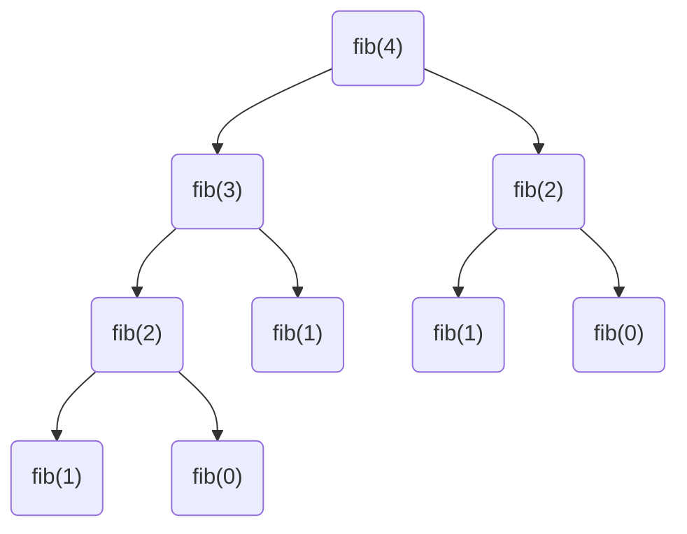

Asymptotic notation is used to describe how the (time) complexity of an
algorithm grows when the size of the problem becomes asymptotically large.

Say, we need to find out the number of characters in a string. One of the ways
we can implement a solution is by counting the characters until we have reached
the end of the string. An implementation in C could be:

import CodeBlock from '@theme/CodeBlock';
import string_length from '!!raw-loader!/src/c/misc/string_length.c';

<CodeBlock language="c" title="src/c/misc/string_length.c" showLineNumbers>{string_length}</CodeBlock>

The above algorithm is linear in time. The complexity of the problem grows
linearly with the size of the string. We denote it by: $\mathcal{O}(n)$.

We could have another implementation, where we store the string and its length
in an object (struct). Here we are not interested in how we determined the
length of string in the first place.

import string_length_struct from '!!raw-loader!/src/c/misc/string_length_struct.c';

<CodeBlock language="c" title="src/c/misc/string_length_struct.c" showLineNumbers>{string_length_struct}</CodeBlock>

In the above implementation, no matter how big the string is, we can always get
its length in constant time, i.e., $\mathcal{O}(1)$

Let's consider another example: looking up for a contact in a phone book. We
have contacts sorted alphabetically, and we have to find the phone number of
person. One way could be to start from the beginning until we have found the
person i.e., a linear search algorithm. That would be a $\mathcal{O}(n)$
algorithm.

We could have another algorithm, where we first look up in the middle of the
list (which is sorted alphabetically), if the name matches we stop there.
Otherwise, if the name starts with an alphabet before the one we are looking in
the middle, we again divide the first half of the list and look in its middle,
and continue this process until we have found the person's name. This algorithm
has $\mathcal{O}(\log(n))$ complexity.

:::tip

To be precise, here the logarithm has base 2. However, all logarithmic functions
with base greater than 1, are asymptotically equivalent.

$$
\log_a(N) = \frac{\log_b(N)}{\log_b(a)}
$$

as $\log_b(a)$ is a constant.

:::

In the best case scenario, we can find the person in first step, if it's exactly
in the middle of the list. We denote best case scenario by $\Omega(1)$.

In cases where the best case and asymptotic case have the same complexity, we
denote it by $\Theta(n)$, tight asymptotic bound. For example our second
implementation of string length example above, where we store the length as a
data member, the best case and worst case scenario both have same complexity
$\Theta(1)$.

Nested loops:
```c
for (int i = 0; i < N; i++)
{
    for (int j = 0; j < M; j++)
    {
        arr[i][j] = i * M + j;
    }
}
```

In such cases, the complexity grows as $\mathcal{O}(MN)$. If $M$ and $N$ are of
same order, we can say complexity is $\mathcal{O}(N^2)$.

### Mathematical definition

$f(n)$ has complexity $\mathcal{O}(g(n))$ if
$$
f(n) \le c g(n)
$$
for all $n \gt n_0$; $c$ and $n_0$ are constants.

$f(n)$ has complexity lower bound $\Omega(g(n))$ if
$$
f(n) \ge c g(n), \ \forall \ n \gt n_0
$$

$f(n)$ has complexity tight bound $\Theta(g(n))$ if and only if

(1) $f(n)$ is $\mathcal{O}(g(n))$

(2) $f(n)$ is $\Omega(g(n))$

$$
c g(n) \le f(n) \le c' g(n)
$$

:::note

Mathematically if $f(n)$ is $\mathcal{O}(n)$, it is also $\mathcal{O}(n^2)$ or
$\mathcal{O}(n^3)$. However, we are only interested in the tightest possible
upper bound.

:::

### Complexity of recursive functions

Recursion could be very useful and elegant way to solve certain type of
problems. Using recursion the problem is reduced or divided into smaller parts,
and once we reach the base case the problem has constant time complexity.

In case of [Fibonacci](/basics/recursion) series calculation (C++ example code):

$$
\begin{aligned}
T(n) &= T(n-1) + T(n-2) + c \\
&= \big(T(n-2) + T(n-3) + c\big) + \big(T(n-3) + T(n-4) + c\big) + c
\end{aligned}
$$

Where $T(n)$ is constant for $n \le 1$.



In this program, the number of function call grows exponentially with complexity
$\mathcal{O}(2^n)$.

### Master theorem

Let $a \ge 1$ and $b \gt 1$ be constants, let $f(n)$ be a function, and let
$T(n)$ be a function over the positive numbers defined by the recurrence:

$T(n) = aT(n/b) + f(n)$

If $f(n) = \Theta(n^d)$, where $d \ge 0$, then

$T(n) = \Theta(n^d)$ if $a \lt b^d$,

$T(n) = \Theta(n^d \log n)$ if $a = b^d$,

$T(n) = \Theta(n^{\log_b a})$ if $a \gt b^d$.

**Example:** Complexity of binary search problem is $\mathcal{O}(\log n)$,
complexity of merge sort is $\mathcal{O}(n \log n)$.

## Resources
- [Asymptotic notation lecture from Harvard CS50](https://www.youtube.com/watch?v=iOq5kSKqeR4)
- [Mathematics lecture](https://www.youtube.com/watch?v=ei-A_wy5Yxw&list=PL1BaGV1cIH4UhkL8a9bJGG356covJ76qN&index=3)
