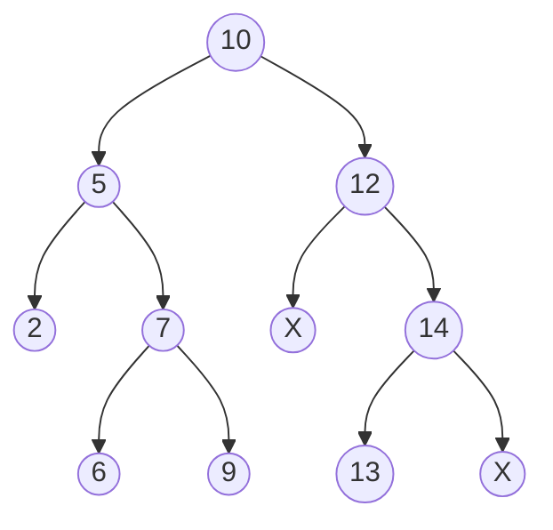

Tree is a dynamic data structure composed of multi-levels of linked lists. A
tree is defined as a node which consists of a value together with a list of
references (pointers) to other such nodes. The top most node is called **root**
of the tree. Nodes are called parent if they points to other nodes, which are
called **children**.

The simplest type of tree is a binary tree. A node in binary tree can have a
maximum of two references (called children), denoted by **left** and **right**.
Nodes without children is called leaf. The parent, grand parent, ... of a node
is called ancestor nodes.

**Depth:** the depth of a node is the number of its ancestors. It is also the
number of edges from that particular node to the root node. Root node has depth
0.

**Height:** height of a node is the number of edges in the longest downward
path. It is also the maximum depth of subtree rooted on that particular node.
All leafs have height 0.

**Size:** of a node is the number of nodes (including the node itself) in the
subtree rooted on that node.

**Set vs. Sequence:** when we work on a set interface, we look for items in a
tree using the key. On the other hand, in case of a sequence implementation, we
look for items by its index. When looking for items by index, size of a subtree
is important. Below is a pseudo code to find item by index:

```c
tree *search(tree *node, i) {
    size_left = size(node->left)
    if (i < size_left) {
        search(node->left, i)
    } else if (i == size_left) {
        return node;
    } else { // i > size_left
        search(node->right, i - size_left - 1)
    }
}
```

**Subtree augmentation:** we can maintain certain properties of a subtree as a
data member of a node, e.g, size of a subtree, minimum, maximum. Then we can
calculate size of any tree/subtree in constant time. Whenever, we insert or
delete new item to the tree, we need to update those node properties as well. We
must be able to efficiently (time complexity better than or same as
$\mathcal{O}(h)$) maintain such properties during tree modification. There are
properties that we can not maintain efficiently such as index of a node; that
would be $\mathcal{O}(n)$ operation.

### Binary Search Tree

A Binary Search Tree (BST) is a binary tree with following properties:
1. All node keys are distinct
2. The left subtree of a node contains only keys less than its key
3. Right subtree contains only keys greater than current node key
4. Both left and right subtrees are also binary search tree.

Example:



`X` here represents `NULL` pointer.

Since BST provides an ordering among the node keys, operations such search,
find minimum, maximum becomes easier. The search depth of BST depends on the
shape of the tree. If a tree is balanced the complexity is
$\mathcal{O}(h)$. In the worst case, when the tree is highly unbalanced (a
singly linked list) the time complexity of search is $\mathcal{O}(n)$.

import Tabs from '@theme/Tabs';
import TabItem from '@theme/TabItem';
import CodeBlock from '@theme/CodeBlock';

<Tabs groupId="language">

<TabItem value="C">

import binary_tree_c from '!!raw-loader!/src/c/data-structure/binary-tree.c';

<CodeBlock language="c" title="src/c/data-structure/binary-tree.c" showLineNumbers>{binary_tree_c}</CodeBlock>

</TabItem>

<TabItem value="C++">

import binary_tree_cpp from '!!raw-loader!/src/cpp/data-structure/binary-tree.cpp';

<CodeBlock language="cpp" title="src/cpp/data-structure/binary-tree.cpp" showLineNumbers>{binary_tree_cpp}</CodeBlock>

</TabItem>
</Tabs>

### Traversal algorithms

**Pre-order traversal:** `node` → `node->left` → `node->right`

**In-order traversal:** `node->left` → `node` → `node->right`. In the above tree
diagram, in-order traversal would be: 2, 5, 6, 7, 9, 10, 12, 13, 14.

**Post-order traversal:** `node->left` → `node->right` → `node`.

Note that there could be more than one (unique) tree representation for the same
traversal order.

### Depth First Search

Above traversal algorithms are depth first algorithm, which use a stack for
back-tracking. They can be implemented by recursion as shown in the above code
example.

### Balanced binary tree (AVL tree)

How do we ensure $\mathcal{O}(h) = \mathcal{O}(\log n)$, where $h$ is the height
of a tree and $n$ is the total number of items in the tree? We know that in case
of a balanced binary tree $\mathcal{O}(h) = \mathcal{O}(\log n)$. There are
several category of balanced binary trees.

**Rotation:** We must ensure the traversal order after rotation. We must ensure
that traversal order is unchanged after rotation. In case of AVL tree, we
maintain the height balance. Skew of a node is defined as
`height(node->right) - height(node->left)`. We like to maintain the skew of
any node to be either 0, or 1 or -1. If we can maintain height balance,
$\mathcal{O}(h) = \mathcal{O}(\log n)$, indeed.


After rotation we need to update the subtree properties of A, B, and all their
ancestors, which could be done in $\mathcal{O}(\log n)$ time.

### Resources

- [MIT OCW Binary Trees Lecture 1](https://www.youtube.com/watch?v=76dhtgZt38A&list=PLUl4u3cNGP63EdVPNLG3ToM6LaEUuStEY&index=9) (<a target="_blank" href={require('/resources/MIT6_006S20_r06_binary_tree.pdf').default}>related notes</a>)
- [MIT OCW Binary Trees Lecture 2](https://www.youtube.com/watch?v=U1JYwHcFfso&list=PLUl4u3cNGP63EdVPNLG3ToM6LaEUuStEY&index=11) (<a target="_blank" href={require('/resources/MIT6_006S20_r07_balanced_binary_tree.pdf').default}>related notes</a>)
- <a target="_blank" href={require('/resources/binary_tree_from_general_tree_gavrilova.pdf').default}>Representing general tree as binary tree</a>
