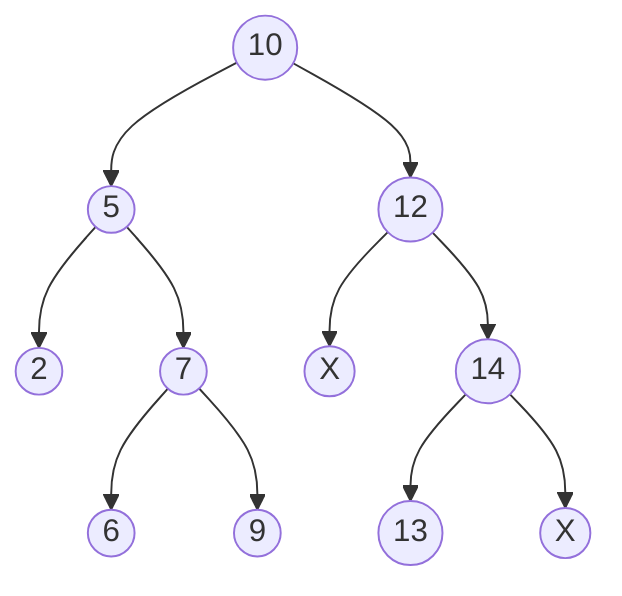

Tree is a dynamic data structure composed of multi-levels of linked lists. A
tree is defined as a node which consists of a value together with a list of
references (pointers) to other such nodes. The top most node is called **root**
of the tree. Nodes are called parent if they points to other nodes, which are
called **children**.

## Binary Tree

The simplest type of tree is a binary tree. A node in binary tree can have a
maximum of two references (called children), denoted by **left** and **right**.

### Binary Search Tree

A Binary Search Tree (BST) is a binary tree with following properties:
1. All node keys are distinct
2. The left subtree of a node contains only keys less than its key
3. Right subtree contains only keys greater than current node key
4. Both left and right subtrees are also binary search tree.

Example:

`X` here represents `NULL` pointer.

Since BST provides an ordering amomng the node keys, operations such search,
find minimum, maximum becomes easier. The search depth of BST depends on the
shape of the tree. If a tree is balanced the complexity is
$\mathcal{O}(\log n)$. In the worst case, when the tree is highly unbalanced
(a sigly linked list) the time complexity of search is $\mathcal{O}(n)$.

import Tabs from '@theme/Tabs';
import TabItem from '@theme/TabItem';
import CodeBlock from '@theme/CodeBlock';

<Tabs groupId="language">

<TabItem value="C">

import binary_tree_c from '!!raw-loader!/src/c/data-structure/binary-tree.c';

<CodeBlock language="c" title="src/c/data-structure/binary-tree.c" showLineNumbers>{binary_tree_c}</CodeBlock>

</TabItem>

<TabItem value="C++">

import binary_tree_cpp from '!!raw-loader!/src/cpp/data-structure/binary-tree.cpp';

<CodeBlock language="cpp" title="src/cpp/data-structure/binary-tree.cpp" showLineNumbers>{binary_tree_cpp}</CodeBlock>

</TabItem>
</Tabs>

### Traversal algorithms

**Pre-order traversal:** `node` → `node->left` → `node->right`
**In-order traversal:** `node->left` → `node` → `node->right`
**Post-order traversal:** `node->left` → `node->right` → `node`

### Depth First Search

Above traversal algorithms are depth first algorithm, which use a stack for
back-tracking. They can be implemented by recusion as shown in the above code
example.

### Resources

- [MIT OCW Binary Trees Lecture 1](https://www.youtube.com/watch?v=76dhtgZt38A&list=PLUl4u3cNGP63EdVPNLG3ToM6LaEUuStEY&index=9) (<a target="_blank" href={require('/resources/MIT6_006S20_r06_binary_trees.pdf').default}>related notes</a>)
- [MIT OCW Binary Trees Lecture 2](https://www.youtube.com/watch?v=U1JYwHcFfso&list=PLUl4u3cNGP63EdVPNLG3ToM6LaEUuStEY&index=11) (<a target="_blank" href={require('/resources/MIT6_006S20_r07_balanced_binary_trees.pdf').default}>related notes</a>)
