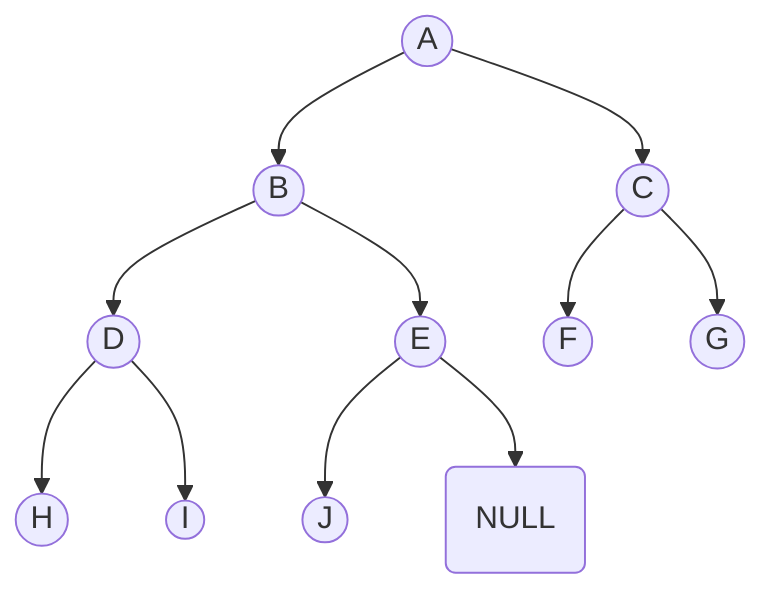

**Priority Queue interface:**
- `build(x)`
- `insert(x)`: add item `x`
- `delete_max()`: delete and return max key item
- `find_max()`: return max key item.

Keys are the weight or priority in a priority queue.

We could use either any one of the following data structure to implement
priority queue interface:

- Set AVL: all operations take $\mathcal{O}(\log n)$ time.
- Un-sorted array: insert takes constant amortized time, while `delete_max`
would take linear time. Find max item, swap with the last element, and delete
it.
- Sorted array: it's the opposite of unsorted array. It takes linear time to
insert but `find_max` is constant time operation. We can use binary search to
find maximum element but we need to shift items after insertion.

**Priority Queue sort:** insert all items, and `delete_max` all items. The items
will be removed in a sorted order.

$$
T_{build}(n) + n \cdot T_{delete\_max} \le n (T_{insert} + T_{delete\_max})
$$

If we implement priority queue interface with set AVL, it will take
$\mathcal{O}(n \log n)$ time, on the other hand unsorted and sorted array will
basically use selection sort and insertion sort, respectively, both of which
have $\mathcal{O}(n^2)$ time bounds. But array sorts are in-place, which is
space efficient, while set AVL sort is not in-place.

**Heaps:** If we have a complete binary tree; there are $2^i$ nodes at
depth $i$ except at the maximum depth where nodes are left justified. The height
is guaranteed to have $\lceil \log n \rceil$ (ceiling).



We can store such a tree using an array in depth order: A, B, C, D, E, F, G, H,
I, J. This is an implicit data structure without any pointers. We can find left
and right child by using index arithmetic.

$$
left\_child(i) = 2 * i + 1
$$
$$
right\_child(i) = 2 * i + 2
$$
$$
parent(i) = \left\lfloor \frac{i - 1}{2} \right\rfloor
$$

$\lfloor~\rfloor$ denotes floor.

**Binary heap (Q):** an array (Q) representing complete binary tree where every
node `i` satisfies **max-heap** property: $Q[i] \ge Q[j]$ for
$j \in \{left(i), right(i)\}$. This follows $Q[i] \ge Q[j]$ for any node `j` in
subtree(i).

**find_max** is very easy, it must be the root, first element in the array.

**insert_last(x)** we insert `x` on the last leaf. But we need to make sure the
heap satisfy the max-heap property. Below is a pseudo code:

```c
max_heapify_up(i) {
    if (i == 0) {
        return;
    }
    if (Q[parent(i)].key < Q[i].key) {
        swap(Q[parent(i)], Q[i]);
    }
    max_heapify_up(parent(i));
}
```

**delete_max():**
- `swap(Q[0], Q[|Q| -1])`
- `delete_last()`
- `max_heapify_down(0)`

**max_heapify_down(i)**
- if `i` is a leaf: done
- let $j \in \{left(i), right(i)\}$, find the maximum of left and right key
- if Q[i] < Q[j]: swap(Q[i], Q[j])
- recurse on `j`.

### Heap sort
We can start with an empty binary heap, increase it's size by one and
repeatedly absorb elements of an unsorted array. Later repeatedly apply
`delete_max()` to sort an array, it's called heap sort.


### Resources
- [MIT OCW Binary Heaps Lecture](https://www.youtube.com/watch?v=Xnpo1atN-Iw&list=PLUl4u3cNGP63EdVPNLG3ToM6LaEUuStEY&index=12) (<a target="_blank" href={require('/resources/MIT6_006S20_r08_binary_heap.pdf').default}>related notes</a>)
